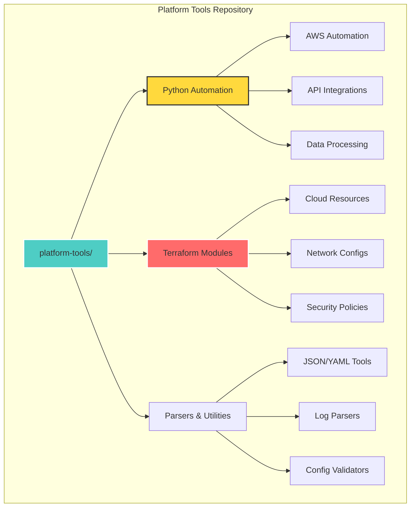
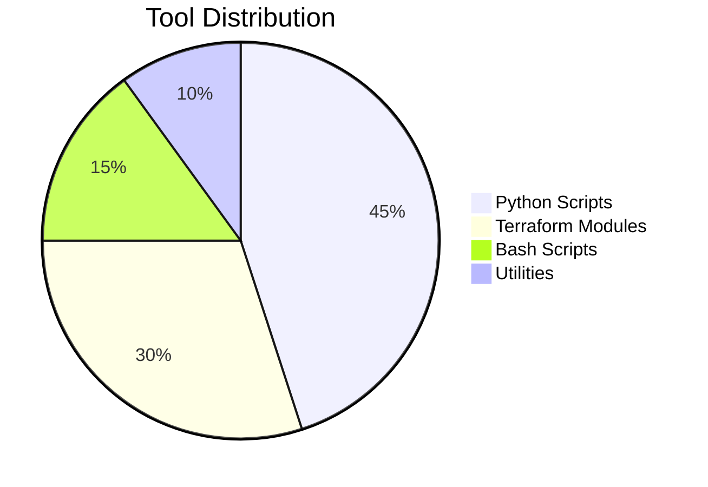

# 🛠️ Platform Tools - Open Source Automation Utilities

[](https://github.com/EvanusModestus/platform-tools)
[](LICENSE)
[](https://www.python.org/)
[](https://www.terraform.io/)
[](CONTRIBUTING.md)

> Production-ready automation tools and utilities for platform engineering, infrastructure as code, and DevOps workflows.

## 📚 Table of Contents

- [Overview](#-overview)
- [Tool Categories](#-tool-categories)
- [Quick Start](#-quick-start)
- [Featured Tools](#-featured-tools)
- [Installation](#-installation)
- [Usage Examples](#-usage-examples)
- [Contributing](#-contributing)
- [Security](#-security)
- [License](#-license)

## 🎯 Overview

This repository contains battle-tested tools and scripts developed for real-world platform engineering challenges. Each tool is designed to be:

- **Modular** - Use individually or combine for complex workflows
- **Documented** - Clear usage instructions and examples
- **Secure** - No hardcoded credentials or sensitive data
- **Efficient** - Optimized for performance and reliability
- **Reusable** - Generic enough for various environments

## 📦 Tool Categories



### 🐍 Python Automation (`python-automation/`)

| Tool | Purpose | Status |
|------|---------|--------|
| `cloud-resource-tagger.py` | Bulk tag AWS/Azure resources | ✅ Production |
| `ssl-cert-checker.py` | Monitor SSL certificate expiration | ✅ Production |
| `api-rate-limiter.py` | Smart rate limiting for API calls | ✅ Production |
| `config-drift-detector.py` | Detect configuration drift | 🔄 Beta |

### 🏗️ Terraform Modules (`terraform-modules/`)

| Module | Description | Cloud |
|--------|-------------|-------|
| `vpc-baseline` | Secure VPC with best practices | AWS |
| `aks-cluster` | Production AKS setup | Azure |
| `gke-autopilot` | GKE Autopilot cluster | GCP |
| `multi-region-s3` | Multi-region S3 with replication | AWS |

### 🔧 Parsers & Utilities (`parsers/`)

| Utility | Function | Language |
|---------|----------|----------|
| `json-to-yaml` | Convert between formats | Python |
| `log-aggregator` | Aggregate multi-source logs | Python |
| `config-validator` | Validate YAML/JSON configs | Python |
| `csv-to-json` | Transform CSV data | Python |

## 🚀 Quick Start

### Prerequisites

```bash
# Required
python >= 3.8
terraform >= 1.0

# Optional but recommended
aws-cli
azure-cli
jq
yq
```

### Installation

```bash
# Clone the repository
git clone https://github.com/EvanusModestus/platform-tools.git
cd platform-tools

# Install Python dependencies
pip install -r requirements.txt

# Initialize Terraform modules
cd terraform-modules
terraform init
```

## ⭐ Featured Tools

### 1. Cloud Resource Tagger

Automatically tag cloud resources based on policies:

```python
# Example usage
python python-automation/cloud-resource-tagger.py \
  --provider aws \
  --region us-east-1 \
  --tags-file tags.yaml \
  --dry-run
```

```yaml
# tags.yaml
tags:
  Environment: production
  Owner: platform-team
  CostCenter: engineering
  ManagedBy: terraform
```

### 2. SSL Certificate Checker

Monitor SSL certificates across multiple domains:

```bash
python python-automation/ssl-cert-checker.py \
  --domains domains.txt \
  --days-warning 30 \
  --output json
```

### 3. Terraform VPC Module

Deploy a production-ready VPC:

```hcl
module "vpc" {
  source = "./terraform-modules/vpc-baseline"
  
  cidr_block = "10.0.0.0/16"
  region     = "us-east-1"
  
  public_subnets  = ["10.0.1.0/24", "10.0.2.0/24"]
  private_subnets = ["10.0.10.0/24", "10.0.11.0/24"]
  
  enable_nat_gateway = true
  enable_vpn_gateway = false
  
  tags = {
    Environment = "production"
    ManagedBy   = "terraform"
  }
}
```

## 📖 Usage Examples

### Example 1: Bulk Process JSON Files

```bash
# Convert all JSON files to YAML
for file in *.json; do
  python parsers/json-to-yaml.py "$file" "${file%.json}.yaml"
done
```

### Example 2: Validate Terraform Configurations

```bash
# Validate all Terraform files
python parsers/config-validator.py \
  --type terraform \
  --path ./infrastructure \
  --recursive
```

### Example 3: API Rate Limiting

```python
from python_automation import APIRateLimiter

# Create rate limiter (10 requests per second)
limiter = APIRateLimiter(rate=10, period=1)

# Use in your API calls
@limiter.limit
def call_api(endpoint):
    return requests.get(endpoint)
```

## 🤝 Contributing

Contributions are welcome! Please follow these guidelines:

### Adding a New Tool

1. Create a feature branch
2. Add your tool in the appropriate directory
3. Include a README with:
   - Purpose and use cases
   - Installation requirements
   - Usage examples
   - Configuration options
4. Add tests if applicable
5. Submit a pull request

### Code Standards

- **Python**: Follow PEP 8
- **Terraform**: Use terraform fmt
- **Documentation**: Clear and concise
- **Security**: No hardcoded secrets

## 🔒 Security

### Best Practices

- ✅ Use environment variables for credentials
- ✅ Implement proper error handling
- ✅ Validate all inputs
- ✅ Use secure communication (HTTPS/TLS)
- ✅ Follow principle of least privilege

### Reporting Security Issues

Please report security vulnerabilities via private message rather than public issues.

## 📊 Project Stats



## 🗺️ Roadmap

- [ ] Add Kubernetes operators
- [ ] Implement CI/CD templates
- [ ] Add cloud cost optimization tools
- [ ] Create Ansible playbooks
- [ ] Add observability tools

## 📄 License

This project is licensed under the MIT License - see the [LICENSE](LICENSE) file for details.

## 🙏 Acknowledgments

- Platform engineering community
- Open source contributors
- Cloud provider documentation
- DevOps best practices

---

<div align="center">

### 💡 Platform Tools

**Automate** • **Scale** • **Secure** • **Share**

*Building better infrastructure, one tool at a time*

</div>