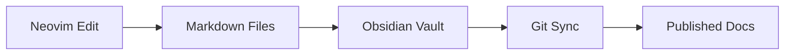
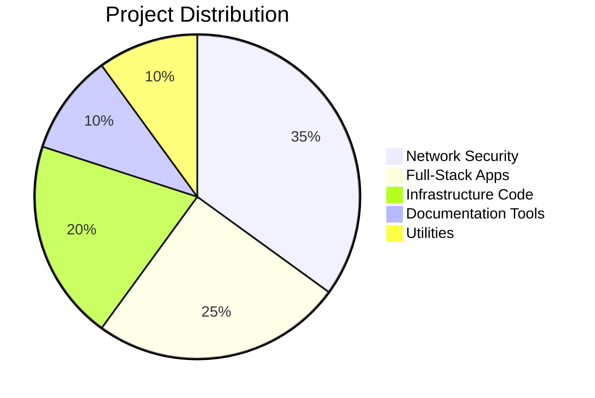

# 🚀 Engineering Solutions Portfolio

> **Network Security | Platform Engineering | Full-Stack Development**
> 
> Open-source tools and documentation showcasing real-world solutions for enterprise infrastructure

[](https://github.com/EvanusModestus)
[](https://linkedin.com/in/evan-rosado)
[](LICENSE)

---

## 🎯 About This Repository

This repository demonstrates production-ready solutions developed through real-world enterprise experience. Each project showcases different aspects of modern infrastructure engineering, from network security automation to full-stack application development.

**Core Competencies:**
- 🔐 **Network Security**: Cisco ISE, 802.1X, Zero Trust Architecture
- ☁️ **Platform Engineering**: Infrastructure as Code, GitOps, Automation
- 🛠️ **Full-Stack Development**: React, Node.js, PostgreSQL
- 📚 **Documentation Systems**: Knowledge Management, Technical Writing
- 🎨 **Visualization**: Network Diagrams, Architecture Documentation

---

## 🗂️ Portfolio Structure

### 🔐 Network Security & Automation

#### [ISE Automation Toolkit](/network-security/ise-automation/)
Enterprise-grade automation for Cisco Identity Services Engine (ISE) deployments.

**Features:**
- Automated 802.1X policy deployment
- Bulk user provisioning with RADIUS profiles
- Certificate lifecycle management
- Compliance reporting and audit trails

**Technologies:** Python, REST APIs, RADIUS, TACACS+

```python
# Example: Automated ISE policy deployment
from ise_automation import ISEController

ise = ISEController(host="ise.example.com")
ise.deploy_policy(
    name="Contractor_Access",
    conditions=["AD:Group=Contractors", "Time:Business_Hours"],
    permissions=["Internet_Only", "VLAN:Guest"]
)
```

#### [Network Diagram Generator](/network-security/diagram-generator/)
Automatically generate network topology diagrams from live configurations.

**Supported Formats:**
- Mermaid diagrams for documentation
- D2 for complex architectures
- PlantUML for sequence diagrams
- Excalidraw for hand-drawn style

---

### 📚 Knowledge Management Systems

#### [Obsidian-Neovim Integration](/pkm-systems/obsidian-nvim/)
Seamless integration between Obsidian vault and Neovim for technical documentation.

**Features:**
- Synchronized markdown editing
- Custom snippets for technical docs
- Automated linking and tagging
- Git-backed version control

**Example Workflow:**


#### [Documentation as Code](/pkm-systems/docs-as-code/)
Templates and tools for maintaining technical documentation alongside code.

**Includes:**
- API documentation generators
- Architecture decision records (ADRs)
- Runbook templates
- Change management docs

---

### 🌐 Full-Stack Applications

#### [Network Monitoring Dashboard](/fullstack/network-dashboard/)
Real-time monitoring dashboard for enterprise networks.

**Tech Stack:**
- **Frontend**: React, TypeScript, D3.js
- **Backend**: Node.js, Express, WebSockets
- **Database**: PostgreSQL, TimescaleDB
- **Monitoring**: SNMP, syslog, REST APIs

**Features:**
- Real-time device status
- Historical trend analysis
- Alert management
- Custom reporting

#### [Configuration Management Portal](/fullstack/config-portal/)
Web-based configuration management for network devices.

**Capabilities:**
- Template-based configurations
- Version control and rollback
- Compliance validation
- Multi-vendor support

---

### 🏗️ Infrastructure as Code

#### [Terraform Network Modules](/infrastructure/terraform/)
Reusable Terraform modules for network infrastructure.

```hcl
module "secure_network" {
  source = "./modules/enterprise-network"
  
  network_segments = {
    production = "10.0.0.0/16"
    staging    = "10.1.0.0/16"
    management = "10.254.0.0/16"
  }
  
  enable_ise_integration = true
  enable_flow_logs       = true
}
```

#### [Ansible Network Playbooks](/infrastructure/ansible/)
Production-ready playbooks for network automation.

- Device provisioning
- Configuration backup
- Compliance checking
- Security hardening

---

### 🔧 Utilities & Tools

#### [Log Parser Collection](/utilities/parsers/)
Specialized parsers for various log formats:
- ISE authentication logs
- Cisco device logs
- Firewall logs
- Application logs

#### [Network Calculators](/utilities/calculators/)
- Subnet calculators with VLSM
- VLAN planner
- IP address management
- Bandwidth calculators

---

## 💼 Real-World Impact

### Case Study 1: Enterprise 802.1X Deployment
**Challenge:** Deploy 802.1X across 500+ switches, 10,000+ endpoints

**Solution:** Automated deployment toolkit reducing implementation time by 75%

**Results:**
- ✅ Zero-downtime migration
- ✅ 100% endpoint compliance
- ✅ Automated troubleshooting reducing tickets by 60%

### Case Study 2: Documentation System Overhaul
**Challenge:** Fragmented documentation across multiple platforms

**Solution:** Unified PKM system using Obsidian + Git + Neovim

**Results:**
- ✅ Single source of truth
- ✅ Version-controlled documentation
- ✅ Automated publishing pipeline

---

## 🚀 Quick Start

### Prerequisites
```bash
# Core requirements
python >= 3.8
node >= 16.0
terraform >= 1.0
ansible >= 2.9

# Optional but recommended
docker
postgresql
git
```

### Installation
```bash
# Clone the repository
git clone https://github.com/EvanusModestus/platform-tools.git
cd platform-tools

# Install dependencies
make install

# Run tests
make test

# Start development environment
make dev
```

---

## 📈 Skills Demonstrated

### Programming Languages


### Technologies


### Tools & Platforms


---

## 🤝 Let's Connect

I'm passionate about solving complex infrastructure challenges and sharing knowledge with the community.

### Professional Interests
- 🔒 Zero Trust Security Architecture
- 🚀 Platform Engineering Best Practices
- 📊 Data-Driven Network Operations
- 🎯 DevOps/NetOps Convergence
- 📚 Technical Documentation Systems

### Open for Collaboration
- Enterprise network automation projects
- Open-source security tools
- Documentation system design
- Technical writing and tutorials

### Contact
- 📧 Email: [evan.rosado@outlook.com](mailto:evan.rosado@outlook.com)
- 💼 LinkedIn: [Connect on LinkedIn](https://linkedin.com/in/evan-rosado)
- 🐦 X: [@EvanusModestus](https://x.com/EvanusModestus)
- 📝 Blog: [Technical Blog](https://github.com/EvanusModestus/tech-blog)

---

## 📚 Documentation

Each project includes comprehensive documentation:
- **README**: Overview and quick start
- **INSTALL**: Detailed installation instructions
- **USAGE**: Complete usage examples
- **API**: API documentation (where applicable)
- **CONTRIBUTING**: How to contribute

---

## 🎓 Learning Resources

### Tutorials & Guides
- [Building Enterprise PKM Systems](docs/tutorials/pkm-systems.md)
- [Network Automation with Python](docs/tutorials/network-automation.md)
- [ISE Integration Best Practices](docs/tutorials/ise-integration.md)
- [Documentation as Code Workflow](docs/tutorials/docs-as-code.md)

### Architecture Patterns
- [Zero Trust Network Design](docs/patterns/zero-trust.md)
- [GitOps for Network Engineers](docs/patterns/gitops-networking.md)
- [Event-Driven Automation](docs/patterns/event-driven.md)

---

## 📊 Repository Statistics



---

## 🗺️ Roadmap

### Q1 2025
- [ ] Kubernetes network policy generator
- [ ] AI-powered log analysis
- [ ] GraphQL API for network data

### Q2 2025
- [ ] Multi-cloud network orchestrator
- [ ] Security posture dashboard
- [ ] Automated penetration testing toolkit

---

## 📄 License

This repository is licensed under the MIT License - see the [LICENSE](LICENSE) file for details.

## 🙏 Acknowledgments

Special thanks to:
- The open-source community
- Network engineering professionals who provided feedback
- Security researchers who helped improve these tools

---

<div align="center">

### 💡 Engineering Excellence Through Automation

**Design** • **Build** • **Automate** • **Document** • **Share**

*Transforming complex infrastructure challenges into elegant solutions*

[](https://github.com/EvanusModestus/platform-tools)
[](https://github.com/EvanusModestus)

</div>