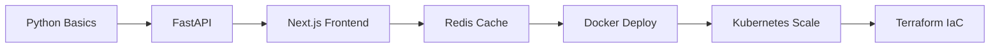
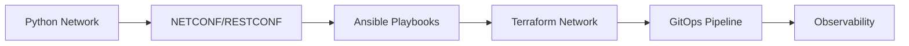
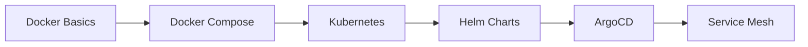

# 🧪 Technology Practice Labs

> Hands-on labs for mastering every technology in your stack

## 🎯 Technology Focus Areas

### 🔥 Primary Focus (Your Core Stack)
| Technology | Your Level | Lab Focus | Why Important |
|------------|------------|-----------|---------------|
| [Python](./python/) | Expert | Network automation, APIs, Data processing | Core skill for automation |
| [JavaScript/TypeScript](./javascript/) | Advanced | Full-stack apps, Node.js backends | Essential for modern web |
| [Next.js/React](./nextjs/) | Advanced | Dashboards, Real-time UIs | Portfolio projects |
| [Terraform](./terraform/) | Intermediate | Infrastructure as Code | Platform engineering must-have |
| [Docker/Kubernetes](./containers/) | Intermediate | Container orchestration | DevOps foundation |

### 🌟 Secondary Focus (Expanding Skills)
| Technology | Your Level | Lab Focus | Why Important |
|------------|------------|-----------|---------------|
| [Ansible](./ansible/) | Advanced | Network automation | Complements Python |
| [PostgreSQL](./postgresql/) | Advanced | Database design, optimization | Data persistence |
| [Bash](./bash/) | Expert | Scripting, automation | System administration |
| [Git/GitHub Actions](./git-cicd/) | Intermediate | CI/CD pipelines | Automation workflows |

### 🎯 Learning Targets (New Technologies)
| Technology | Goal | Lab Focus | Timeline |
|------------|------|-----------|----------|
| [GraphQL](./graphql/) | Learn | API development | Q4 2025 |
| [Go](./golang/) | Learn | High-performance tools | Q4 2025 |
| [Rust](./rust/) | Learn | Systems programming | Q1 2026 |
| [AWS](./aws/) | Certify | Cloud infrastructure | Q4 2025 |
| [Prometheus/Grafana](./observability/) | Learn | Monitoring | Q1 2026 |

## 🚀 Quick Start

```bash
# Clone the labs
git clone https://github.com/EvanusModestus/platform-tools.git
cd platform-tools/labs

# Pick a technology
cd redis/01-beginner/project-01-session-store

# Follow the README
cat README.md

# Start coding!
nvim main.py
```

## 📈 Learning Paths

### Path 1: Full-Stack Platform Engineer


### Path 2: Network Automation Expert


### Path 3: Modern DevOps


## 🎮 Daily Challenge System

Today's Challenge: **Redis Sorted Sets**
- Difficulty: ⭐⭐⭐☆☆
- Time Limit: 30 minutes
- [Start Challenge](./daily-challenges/2025-09-01-redis-sorted-sets.md)

## 📊 Lab Statistics

```yaml
total_labs_available: 45
total_projects: 120
challenge_count: 365
integration_projects: 12
languages_covered: 6
frameworks_covered: 15
```

## 🏆 Completed Projects Showcase

### Recent Completions
1. **ISE Policy Automation** - Python + REST API [View](./completed/ise-policy-automation/)
2. **Network Topology Visualizer** - Next.js + D3.js [View](./completed/network-visualizer/)
3. **Redis Cache Layer** - Node.js + Redis [View](./completed/redis-cache/)

## 📚 Lab Categories

### By Technology Type
- **Languages**: Python, JavaScript, TypeScript, Bash, SQL, Go, Rust
- **Frontend**: React, Next.js, Vue, TailwindCSS, D3.js
- **Backend**: Node.js, FastAPI, Express, GraphQL
- **Database**: PostgreSQL, Redis, MongoDB, TimescaleDB
- **Infrastructure**: Docker, Kubernetes, Terraform, Ansible
- **Cloud**: AWS, GCP, Azure, Railway
- **Networking**: BGP, OSPF, SD-WAN, ISE, RADIUS

### By Difficulty
- **🟢 Beginner**: 15 labs - Start here if new to technology
- **🟡 Intermediate**: 18 labs - Build real applications
- **🔴 Advanced**: 8 labs - Enterprise-scale projects
- **⚫ Expert**: 4 labs - Cutting-edge implementations

### By Time Commitment
- **Quick (< 1 hour)**: Daily challenges, small scripts
- **Short (2-4 hours)**: Single-feature projects
- **Medium (8-16 hours)**: Full applications
- **Long (40+ hours)**: Enterprise projects

## 🔗 Resources

### Documentation
- [Lab System Guide](../TECHNOLOGY_LAB_SYSTEM.md)
- [Project Templates](./templates/)
- [Solution Archive](./solutions/)

### External Resources
- [Technology Docs Hub](./resources/docs.md)
- [Video Tutorials](./resources/videos.md)
- [Community Projects](./resources/community.md)

## 📝 Contributing

Want to add a lab? Follow our [Contribution Guide](./CONTRIBUTING.md)

Template for new labs:
```bash
./scripts/create-new-lab.sh \
  --technology "GraphQL" \
  --difficulty "intermediate" \
  --type "api-development" \
  --estimated-hours 8
```

## 🎯 Learning Goals Tracker

### Q4 2025 Goals
- [ ] Complete 5 Redis labs
- [ ] Build 3 full-stack projects
- [ ] Contribute to 2 open source projects
- [ ] Pass AWS Solutions Architect
- [ ] Master Kubernetes basics

### Weekly Targets
- **Labs Completed**: 3-5
- **Challenges**: Daily
- **Documentation**: Every project
- **Code Review**: Weekly with peers

---
*Part of the [Platform Tools Portfolio](../README.md)*