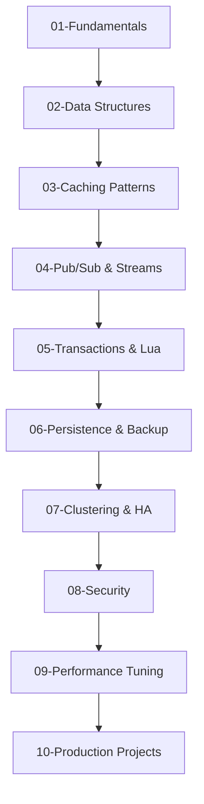

# 🔴 Redis Mastery Lab

> From basic caching to advanced Redis patterns for production systems

## 🎯 Learning Objectives

By completing this lab series, you will:
- ✅ Master all Redis data structures
- ✅ Implement production caching strategies
- ✅ Build real-time systems with Pub/Sub
- ✅ Design distributed systems with Redis
- ✅ Optimize performance for scale
- ✅ Implement Redis security best practices

## 📊 Your Current Level Assessment

```yaml
current_skills:
  basic_operations: "completed"     # GET, SET, DEL
  data_structures: "in_progress"    # Lists, Sets, Hashes
  advanced_patterns: "not_started"  # Lua, Transactions
  production_skills: "not_started"  # Clustering, Persistence
```

## 🗺️ Learning Path



## 📁 Lab Structure

```
redis/
├── 00-setup/
│   ├── docker-setup.md          # Local Redis with Docker
│   ├── redis-cli-basics.md      # CLI fundamentals
│   └── connection-testing.md    # Verify setup
│
├── 01-beginner/
│   ├── project-01-session-store/
│   │   ├── README.md            # Session management system
│   │   ├── requirements.txt
│   │   ├── app.py
│   │   └── tests/
│   ├── project-02-rate-limiter/
│   │   ├── README.md            # API rate limiting
│   │   ├── limiter.js
│   │   └── tests/
│   └── challenges/
│       ├── challenge-01-cache-aside.md
│       └── challenge-02-ttl-management.md
│
├── 02-intermediate/
│   ├── project-01-leaderboard/
│   │   ├── README.md            # Real-time gaming leaderboard
│   │   ├── sorted-sets.py
│   │   └── websocket-updates.js
│   ├── project-02-job-queue/
│   │   ├── README.md            # Distributed job queue
│   │   ├── producer.py
│   │   ├── consumer.py
│   │   └── monitor.py
│   └── project-03-chat-system/
│       ├── README.md            # Pub/Sub chat application
│       ├── server.js
│       └── client.html
│
├── 03-advanced/
│   ├── project-01-cache-invalidation/
│   │   ├── README.md            # Smart cache invalidation
│   │   ├── cache-manager.py
│   │   └── consistency-checker.py
│   ├── project-02-distributed-lock/
│   │   ├── README.md            # Redlock implementation
│   │   ├── redlock.py
│   │   └── tests/
│   └── project-03-time-series/
│       ├── README.md            # Network metrics storage
│       ├── metrics-collector.py
│       └── dashboard.html
│
├── 04-expert/
│   ├── project-01-redis-cluster/
│   │   ├── README.md            # Multi-node cluster setup
│   │   ├── cluster-config/
│   │   └── failover-testing/
│   └── project-02-custom-module/
│       ├── README.md            # C module development
│       ├── custom-module.c
│       └── Makefile
│
├── 05-integration/
│   ├── project-01-ise-cache/      # ISE + Redis
│   │   ├── README.md
│   │   ├── ise-cache-layer.py
│   │   └── performance-tests/
│   └── project-02-nextjs-redis/   # Next.js + Redis
│       ├── README.md
│       ├── pages/api/cache.ts
│       └── lib/redis-client.ts
│
├── resources/
│   ├── redis.conf               # Production config template
│   ├── docker-compose.yml       # Multi-Redis setup
│   ├── benchmark-scripts/       # Performance testing
│   └── cheatsheet.md           # Quick reference
│
└── progress.yaml                # Track your progress
```

## 🚀 Current Week's Focus

### Week 1: Data Structures Deep Dive

#### Monday: Strings & Hashes
```python
# Lab: Build a user profile cache
import redis

r = redis.Redis(host='localhost', port=6379, decode_responses=True)

# Challenge: Implement user profile caching
class UserCache:
    def __init__(self, redis_client):
        self.redis = redis_client
    
    def save_user(self, user_id, user_data):
        # TODO: Use HSET for structured data
        pass
    
    def get_user(self, user_id):
        # TODO: Use HGETALL with TTL
        pass
    
    def update_field(self, user_id, field, value):
        # TODO: Atomic field update
        pass
```

#### Tuesday: Lists & Sets
```python
# Lab: Build a task queue and unique visitor tracker
# TODO: Implement LPUSH/RPOP for queue
# TODO: Use SADD for unique tracking
```

#### Wednesday: Sorted Sets
```python
# Lab: Real-time leaderboard
# TODO: ZADD for scoring
# TODO: ZREVRANGE for top players
# TODO: ZRANK for player position
```

#### Thursday: Pub/Sub
```javascript
// Lab: Real-time notifications
// TODO: Implement publisher
// TODO: Create subscriber
// TODO: Handle reconnection
```

#### Friday: Integration Project
```python
# Combine all learned structures
# Build: ISE Alert Dashboard with Redis
# - Cache ISE alerts (Hashes)
# - Queue for processing (Lists)  
# - Unique devices (Sets)
# - Alert priorities (Sorted Sets)
# - Real-time updates (Pub/Sub)
```

## 📈 Progress Tracking

### Completed Labs ✅
- [x] Setup Docker environment
- [x] Basic GET/SET operations
- [x] TTL and expiration

### In Progress 🔄
- [ ] Session store implementation (60%)
- [ ] Rate limiter design (30%)

### Upcoming 📅
- [ ] Leaderboard system
- [ ] Job queue with reliability
- [ ] Pub/Sub chat application

## 🎮 Daily Challenges

### Today's Challenge: "Cache Stampede Prevention"
**Difficulty**: ⭐⭐⭐⭐☆
**Time**: 45 minutes

Your ISE deployment has 10,000 endpoints hitting the cache simultaneously when it expires. Implement a solution to prevent cache stampede.

**Hints**:
- Consider probabilistic early expiration
- Look into lock-based approaches
- Research "thundering herd" problem

[Start Challenge](./challenges/cache-stampede.md) | [View Solution](./solutions/cache-stampede.md)

## 📚 Resources

### Essential Reading
- [Redis In Action](https://www.manning.com/books/redis-in-action) - Practical patterns
- [Redis University](https://university.redis.com/) - Free courses
- [Redis Best Practices](https://redis.io/docs/manual/patterns/) - Official patterns

### Your ISE + Redis Integration Ideas
1. **Authentication Cache**: Cache ISE auth results for 5 minutes
2. **Policy Cache**: Store authorization policies in Redis
3. **Session Store**: Manage admin sessions across ISE nodes
4. **Rate Limiting**: Prevent auth storms
5. **Metrics Buffer**: Collect before writing to PostgreSQL

## 🏆 Achievements

### Unlocked 🔓
- **First Cache**: Implemented basic caching
- **Speed Demon**: Sub-millisecond response time

### Locked 🔒
- **Lua Master**: Write complex Lua scripts
- **Cluster King**: Deploy 6-node cluster
- **Performance Guru**: Handle 100K ops/sec

## 💡 Project Ideas for Portfolio

### Project 1: ISE Performance Cache
Build a caching layer for ISE that:
- Reduces auth time by 90%
- Handles 50K endpoints
- Auto-invalidates on policy change
- Provides real-time metrics

### Project 2: Network Event Stream
Create a system that:
- Ingests syslog/SNMP traps
- Uses Redis Streams
- Processes 10K events/second
- Triggers automated responses

### Project 3: Distributed Config Manager
Develop a tool that:
- Caches device configs
- Tracks config changes
- Implements distributed locks
- Provides instant rollback

---
*Part of the [Technology Labs](../README.md) | [Track Progress](./progress.yaml)*