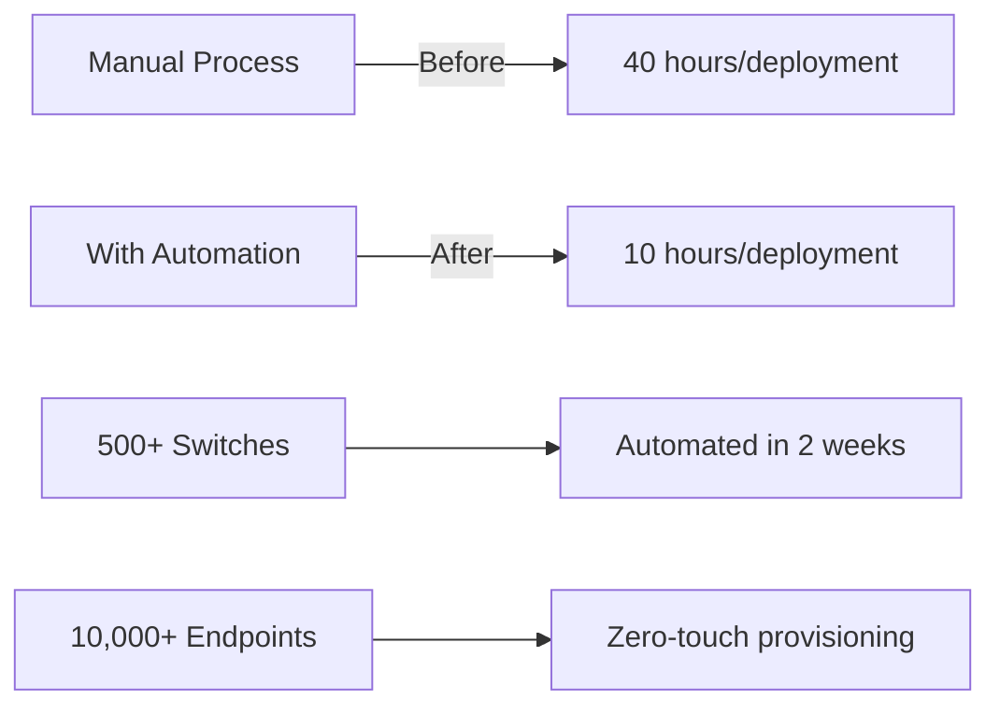

# 🔐 Network Security & Automation Tools

> Enterprise-grade security automation tools for Cisco ISE, 802.1X, and Zero Trust deployments

## 📁 Project Structure

```yaml
network-security/
├── ise-automation/        # Cisco ISE REST API automation
├── dot1x-deployment/      # 802.1X rollout toolkit
├── radius-profiles/       # RADIUS profile generators
├── certificate-manager/   # PKI certificate lifecycle
├── compliance-auditor/    # Security compliance checks
└── diagram-generator/     # Network topology visualization
```

## 🎯 Quick Navigation

| Project | Description | Status | Documentation |
|---------|-------------|--------|---------------|
| [ISE Automation](./ise-automation/) | REST API automation for ISE 3.x | 🟢 Production | [Full Docs](./ise-automation/README.md) |
| [802.1X Deployment](./dot1x-deployment/) | Zero-touch 802.1X rollout | 🟢 Production | [Guide](./dot1x-deployment/README.md) |
| [RADIUS Profiles](./radius-profiles/) | Dynamic RADIUS configuration | 🟡 Beta | [Setup](./radius-profiles/README.md) |
| [Certificate Manager](./certificate-manager/) | EAP-TLS certificate automation | 🟢 Production | [PKI Guide](./certificate-manager/README.md) |

## 🚀 Featured Tool: ISE Automation Toolkit

```python
from ise_automation import ISEController

# Initialize connection to ISE
ise = ISEController(
    host="ise.example.com",
    username="admin",
    password=os.getenv("ISE_PASSWORD")
)

# Deploy 802.1X policy with conditions
ise.deploy_policy(
    name="Contractor_Access",
    conditions=[
        "AD:Group=Contractors",
        "Time:Business_Hours",
        "Device:Type=Managed"
    ],
    permissions=[
        "Internet_Only",
        "VLAN:Guest",
        "ACL:Restricted"
    ]
)

# Bulk provision endpoints
endpoints = ise.import_endpoints("endpoints.csv")
print(f"Provisioned {len(endpoints)} devices")
```

## 📊 Impact Metrics



## 🔧 Installation

```bash
# Clone specific tool
git clone https://github.com/EvanusModestus/platform-tools.git
cd platform-tools/network-security/ise-automation

# Install dependencies
pip install -r requirements.txt

# Configure environment
cp .env.example .env
# Edit .env with your ISE credentials

# Run tests
pytest tests/
```

## 📚 Documentation

Each subdirectory contains:
- `README.md` - Detailed documentation with metadata
- `requirements.txt` - Python dependencies
- `config.yaml` - Configuration templates
- `examples/` - Working examples
- `tests/` - Unit and integration tests

## 🏆 Real-World Deployments

- **Fortune 500 Financial**: 500+ switches, 15,000 endpoints
- **Healthcare Network**: HIPAA-compliant 802.1X across 50 sites
- **University Campus**: 30,000 student devices with BYOD

## 📄 License

MIT License - See [LICENSE](../LICENSE) for details

---
*Part of the [Platform Tools Portfolio](../README.md)*